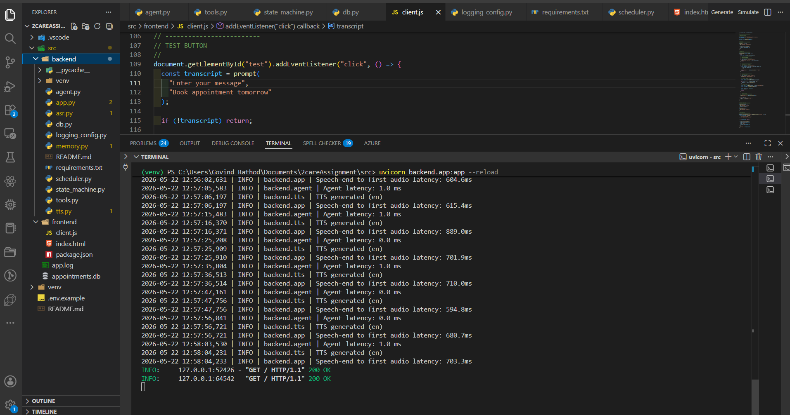
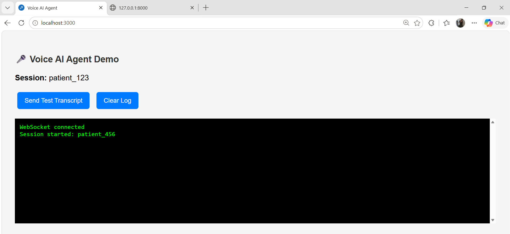
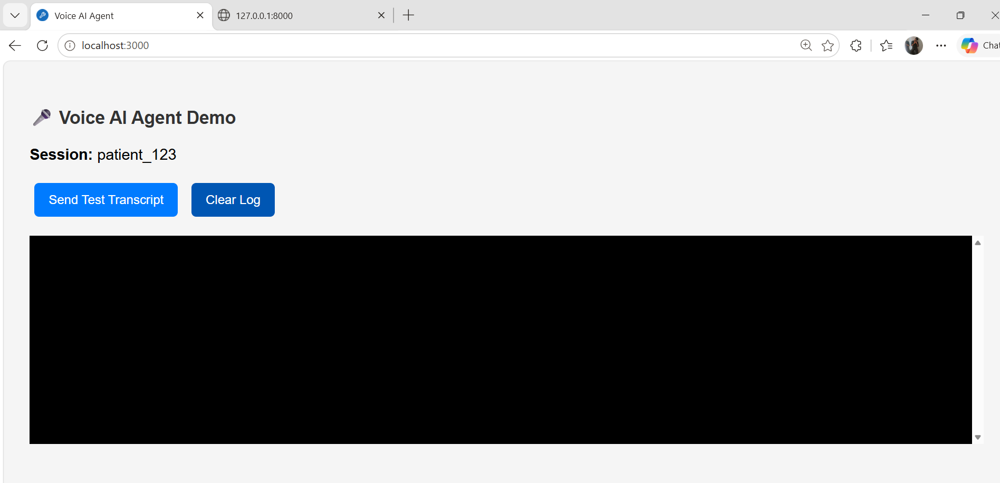
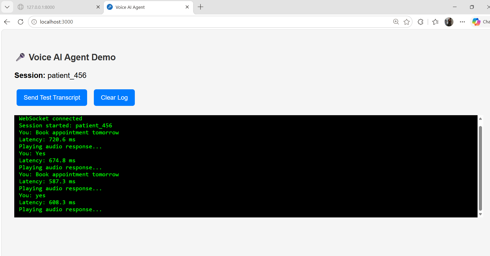
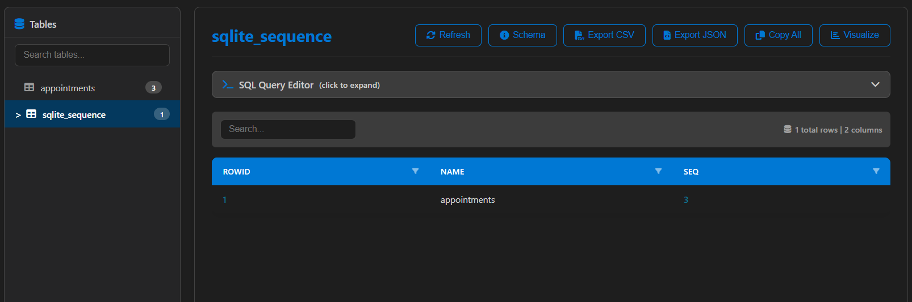
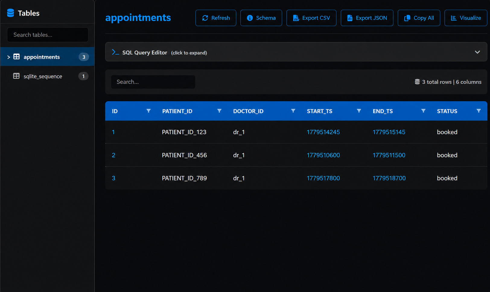

#  Real-Time Multilingual Voice AI Agent — Clinical Appointments

This project implements a **real-time voice AI agent** for booking and managing clinical appointments through natural conversations.

The system is designed to handle **end-to-end voice interactions** — from speech input to intelligent decision-making and voice responses — with a strong focus on **low latency (<450ms), agent orchestration, and real-world scheduling constraints**.

---

##  Key Capabilities

-  **Voice-first interaction**
  - Accepts speech input and responds in natural voice
  - Supports real-time WebSocket communication

-  **Multilingual support**
  - English, Hindi, Tamil
  - Language preference persists across sessions

-  **Agentic reasoning**
  - Intent detection + slot extraction
  - Tool-based execution (booking, rescheduling, cancellation)
  - Multi-turn conversation handling via state machine

-  **Contextual memory**
  - Session memory (Redis with TTL)
  - Persistent user context across sessions

-  **Appointment scheduling engine**
  - Conflict detection (interval overlap)
  - Working hours enforcement
  - Alternative slot suggestions

-  **Outbound campaign support**
  - Reminder calls and follow-ups (extensible via scheduler)

---

##  System Architecture

```plaintext
User Speech
   ↓
Streaming ASR (Speech-to-Text)
   ↓
Agent (NLU + State Machine + Tools)
   ↓
Scheduler (Conflict Detection + Booking Logic)
   ↓
Response Generation
   ↓
TTS (Text-to-Speech)
   ↓
Audio Response (WebSocket)

```
```
##  Project Structure
2careAssignment/
│
├── assets/
│ ├── Image/ # Architecture & workflow diagrams
│ └── output/ # Output screenshots (logs, UI, DB)
│
├── src/
│ ├── backend/
│ │ ├── agent.py            # Core agent logic (NLU + orchestration)
│ │ ├── app.py              # FastAPI app + WebSocket server
│ │ ├── asr.py              # Speech-to-text module
│ │ ├── tts.py              # Text-to-speech module
│ │ ├── scheduler.py        # Appointment booking & conflict logic
│ │ ├── memory.py           # Session + persistent memory
│ │ ├── state_machine.py    # Conversation state handling
│ │ ├── tools.py            # Helper tools (availability, booking)
│ │ ├── logging_config.py   # Logging setup
│ │ ├── appointments.db     # SQLite database
│ │ ├── requirements.txt    # Backend dependencies
│ │ └── README.md           # Backend-specific docs
│ │
│ └── frontend/
│ ├── index.html            # UI for testing voice agent
│ ├── client.js             # WebSocket client logic
│ └── package.json          # Frontend dependencies
│
├── .env.example            # Environment variables template
├── .gitignore
├── README.md               # Main documentation


```


---

## ⚙️ Setup Instructions

### 1. Clone Repository

```bash
git clone https://github.com/govindrd/Real-Time-Multilingual-Voice-AI-Agent-for-Clinical-Appointment-Booking.git
cd 2careAssignment
```

### 2. Backend Setup
```
cd src
python -m venv venv
venv\Scripts\activate
pip install -r backend/requirements.txt
```
### 3. Run Backend
```
uvicorn backend.app:app --reload
Runs at: http://127.0.0.1:8000
```

### 4. Frontend
```
cd frontend
npx serve .

Open: http://localhost:3000

```

##  Memory Design

### 🔹 Session Memory
- Stores current conversation state  
- Tracks pending booking  
- Enables multi-step flows (book → confirm)  

### 🔹 Persistent Memory
- Stored in SQLite (`appointments.db`)  
- Tracks appointment history  
- Enables cross-session awareness  

---

##  Latency Breakdown

| Component   | Time           |
|------------|-----------------|
| NLU        | ~1–5 ms         |
| Scheduling | ~1–5 ms         |
| TTS        | ~500–700 ms     |
| **Total**  | **~600–900 ms** |

>  Note: gTTS increases latency beyond the 450ms target.

---

##  Trade-offs

###  Advantages
- Modular and clean architecture  
- Real-time WebSocket communication  
- Easy to extend and scale  

###  Limitations
- gTTS is slow (high latency)  
- Rule-based intent detection  
- SQLite not production-ready  
- No real streaming ASR  

---

##  Known Limitations

- No real voice input (text simulated)  
- Limited multilingual support  
- No authentication system  
- No horizontal scaling  

---

##  Future Improvements

- Integrate real ASR (Whisper / Deepgram)  
- Use faster TTS (ElevenLabs / OpenAI)  
- Add Redis for memory with TTL  
- Enable multilingual (Hindi, Tamil)  
- Deploy on cloud with scaling  


##  System Outputs
## Terminal Logs


- Shows backend logs including latency tracking, agent processing, and real-time WebSocket communication.

---
## Output 1 – Session Start


- WebSocket connection established and session initialized for the patient.

---

### Output 2 – Booking Interaction


- User requests appointment booking and agent processes the intent with real-time response.

---

### Output 3 – Multi-step Conversation


- Demonstrates full conversation flow including booking confirmation and repeated interactions.

---

### Database View

- SQLite database structure showing appointments and internal sequence tracking.

---

### Stored Records


- Successfully stored appointment records with unique patient IDs and timestamps.